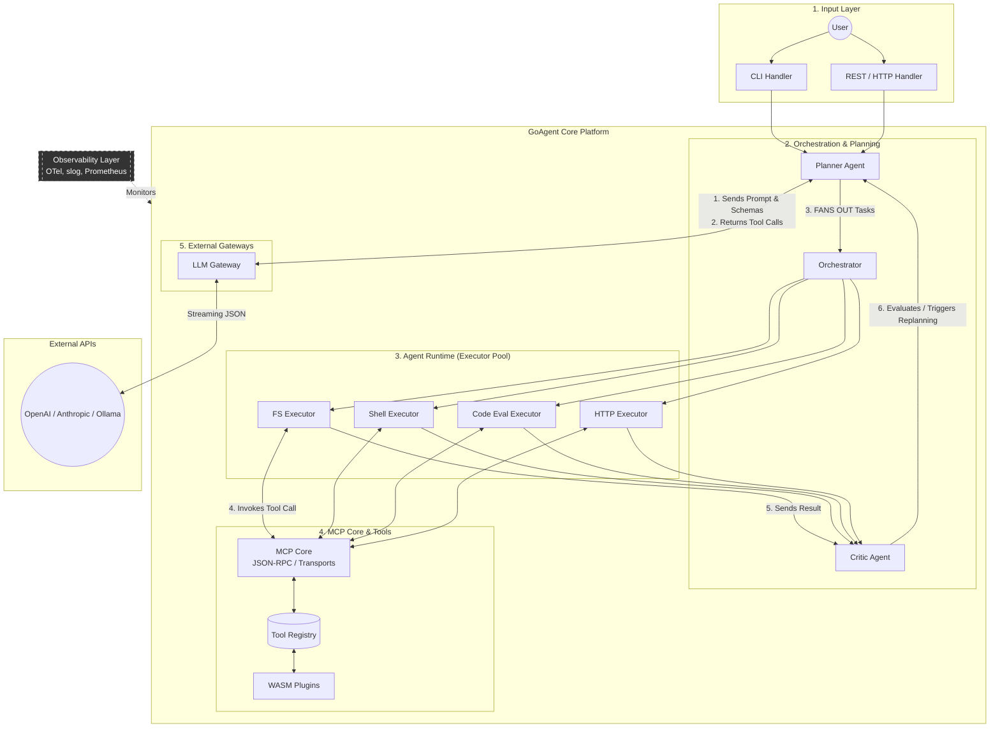

# GoAgent — AI Agent Orchestration Platform in Go

> A production-grade AI agent platform I'm building from scratch in Go — implementing MCP (Model Context Protocol) at the wire layer, orchestrating specialized agents, and exposing a clean tool-use surface to LLM backends.

This is not an SDK wrapper. Every layer — the protocol transport, the JSON-RPC codec, the agent concurrency model, the tool registry — is hand-rolled. The goal is to understand the full stack of agentic AI infrastructure at a systems level, in a language that forces you to think about it seriously.

---

## Architecture



The data flow for a single user request:

1. **Planner** receives the prompt and sends it to the LLM alongside all tool schemas
2. **LLM** returns a list of tool calls — the planner fans these out
3. **Orchestrator** distributes tasks to the relevant executor agents in parallel (`errgroup`)
4. **Each executor** invokes tool calls through the MCP transport layer
5. **Critic** evaluates every result, flags low-confidence outputs, and triggers replanning if needed
6. **Final answer** is synthesized by the planner and returned to the user

---

## Why I'm building this

MCP + agent orchestration is the defining infrastructure problem of AI engineering right now. Everyone's using SDKs. I wanted to understand what's actually happening under the hood — how a protocol gets implemented at the transport level, how you coordinate multiple agents safely with Go's concurrency model, and how you build a plugin system that can hot-reload without downtime.

This project also directly complements [AskMyDocs](https://github.com/ashmitsharp/sutra) — my RAG system. That project covers retrieval and embedding pipelines. This one covers orchestration and tool-use. Together they span the full AI engineering stack.

---

## Tech Stack

| Layer | Technology | Notes |
|-------|-----------|-------|
| Language | Go 1.22+ | Loop variable semantics, typed range |
| Protocol | Hand-rolled MCP | JSON-RPC 2.0, stdio + SSE transports — no SDK |
| CLI | `cobra` | Agent runner, MCP inspector subcommands |
| gRPC | `google.golang.org/grpc` + `buf` | External API, streaming results |
| WASM Runtime | `wazero` | Sandboxed plugin execution, zero CGO |
| Observability | `go.opentelemetry.io/otel` | Distributed traces per agent step |
| Metrics | `prometheus/client_golang` | Per-tool latency histograms, queue depth |
| Logging | `log/slog` (stdlib) | Structured JSON with `trace_id` correlation |
| LLM Clients | Hand-rolled HTTP | OpenAI, Anthropic, Ollama — streaming decoder |
| JSON Schema | `santhosh-tekuri/jsonschema/v5` | Input validation before every tool call |
| File Watching | `fsnotify` | WASM plugin hot-reload |
| Testing | `testing` + `testcontainers-go` | Unit, integration, contract tests |
| Deployment | Helm + Kubernetes | Multi-agent pods, HPA on queue depth |

---

## Repository Structure

```
goagent/
├── mcp/                  # ✅ MCP core library — transport, codec, session, router
│   ├── codec.go          # JSON-RPC 2.0 types + marshal/unmarshal
│   ├── error.go          # Typed error codes (ErrParse, ErrMethodNotFound, etc.)
│   ├── session.go        # Capability negotiation + session state machine
│   ├── router.go         # Method dispatcher + Serve loop
│   ├── transport.go      # Transport interface
│   ├── stdio/            # bufio-based stdio transport
│   └── sse/              # Server-Sent Events HTTP transport
├── agent/                # Agent interface + base runtime lifecycle (Phase 3)
│   ├── planner/          # LLM-driven task decomposition
│   ├── executor/         # Domain executors: fs, shell, http, code
│   └── critic/           # Output evaluation + replanning
├── orchestrator/         # Fan-out/fan-in coordinator, DAG scheduler (Phase 4)
├── tools/                # Tool interface, registry, built-in implementations (Phase 2)
│   └── wasm/             # WASM plugin loader + hot-reload (Phase 5)
├── llm/                  # LLM gateway: OpenAI, Anthropic, Ollama (Phase 3)
├── api/                  # REST + gRPC handlers (Phase 6)
│   └── proto/            # Protobuf definitions
├── observability/        # OTel setup, Prometheus collectors, slog middleware (Phase 6)
├── cmd/
│   ├── goagent/          # Main CLI entrypoint
│   └── mcpinspect/       # ✅ MCP debug inspector over SSE
├── plugins/              # Example WASM plugins (Phase 5)
└── deploy/helm/          # Helm chart for full platform (Phase 6)
```

---

## Implementation Roadmap

| Phase | Focus | Status | Key Deliverable |
|-------|-------|--------|----------------|
| **1 — MCP Core** | JSON-RPC codec, stdio + SSE transports, session, router | ✅ **Done** | `mcp/` package, ~87% test coverage |
| **2 — Tool System** | Tool registry, schema validation, 10 built-in tools | 🔲 Next | `tools/` package, tools callable via MCP |
| **3 — Agent Runtime** | Single-agent run loop, context propagation, retry | 🔲 | One agent completes a 3-step task end-to-end |
| **4 — Orchestration** | Planner + fan-out executors + critic feedback loop | 🔲 | Multi-agent pipeline with OTel traces |
| **5 — WASM Plugins** | Plugin loader via wazero, hot-reload, sandboxed exec | 🔲 | External tool loaded + hot-reloaded at runtime |
| **6 — Production** | OTel tracing, Prometheus metrics, gRPC API, Helm chart | 🔲 | Fully observable, deployed on k8s |

---

## Phase 1 — MCP Core (Completed)

The `mcp/` package is the foundation everything else depends on. I implemented the full Model Context Protocol wire layer from scratch.

### What's in the package

**`codec.go`** — JSON-RPC 2.0 message types and encoding.

The trickiest part was the `ID` type. Per the JSON-RPC spec, an ID can be a string, a number, or `null`. I store it as `json.RawMessage` and defer the type decision to the caller:

```go
type ID struct {
    raw json.RawMessage
}

func (id *ID) UnmarshalJSON(b []byte) error {
    id.raw = append(id.raw[:0], b...)
    return nil
}
```

Builder functions (`NewRequest`, `NewResponse`, `NewNotification`) handle marshalling params into `json.RawMessage` cleanly.

**`error.go`** — Typed JSON-RPC error codes as Go constants:
```go
const (
    ErrParse          = -32700
    ErrMethodNotFound = -32601
    ErrInvalidParams  = -32602
    // MCP-specific
    ErrCapabilityNotSupported = -32000
    ErrSessionNotInitialized  = -32001
)
```

**`session.go`** — The MCP handshake state machine. Before any tool can be called, a client must complete the `initialize` / `notifications/initialized` exchange. I model this as an explicit `SessionState` enum with `sync.RWMutex` protecting transitions — many concurrent reads during normal operation, rare writes on state change.

**`router.go`** — Receives raw `*JSONRPCMessage` from the transport and dispatches to the right handler. Handles the initialize handshake internally, gates all other calls behind `RequireReady()`, and distinguishes requests (need a response) from notifications (fire-and-forget). The `Serve()` loop ties it all together.

**`stdio/stdio.go`** — Newline-delimited JSON over stdin/stdout. Each message is one JSON object followed by `\n`. A `sync.Mutex` serializes concurrent writers. I use `bufio.Scanner` for reading — it handles partial reads and line buffering automatically.

**`sse/sse.go`** — Two HTTP endpoints: `GET /events` holds the SSE stream open, `POST /message` receives client messages. Channels decouple the HTTP handler goroutines from the `Send`/`Recv` interface. I use `http.Flusher` to push SSE frames to the client without buffering.

### Running the inspector

```bash
go run ./cmd/mcpinspect
# Starts an MCP server on :8080

# In another terminal, send an initialize handshake:
curl -X POST http://localhost:8080/message \
  -H "Content-Type: application/json" \
  -d '{"jsonrpc":"2.0","id":1,"method":"initialize","params":{"protocolVersion":"2024-11-05","capabilities":{},"clientInfo":{"name":"curl","version":"0.1"}}}'

# Subscribe to responses:
curl -N http://localhost:8080/events
```

### Test coverage

```
mcp/         91.6%   (codec: 100%, session: 100%, router: 91%)
mcp/stdio/   82.1%
mcp/sse/     74.5%
───────────────────
total        86.8%
```

---

## Getting Started

```bash
git clone https://github.com/ashmitsharp/sutra
cd sutra
go build ./...
go test ./...
```

**Requirements:** Go 1.22+

---
